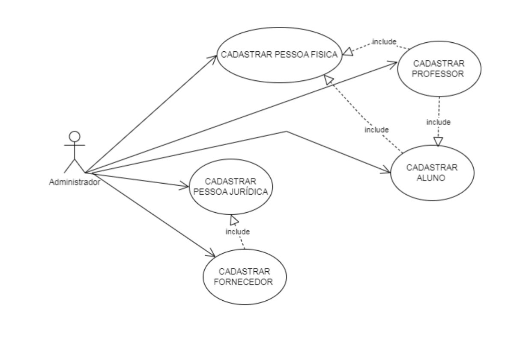
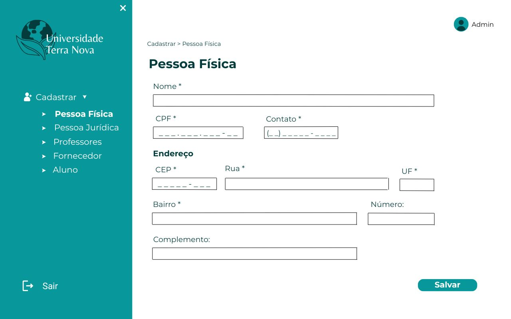
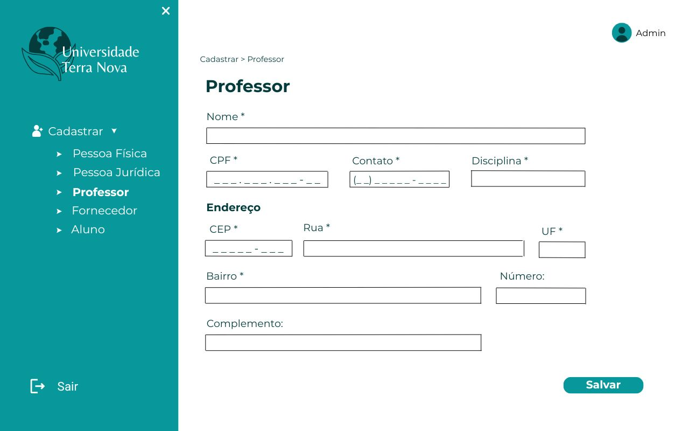
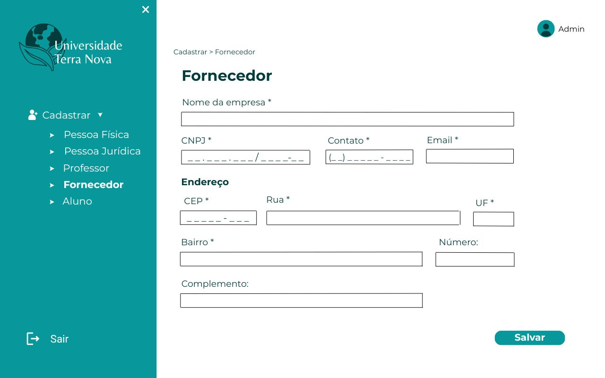
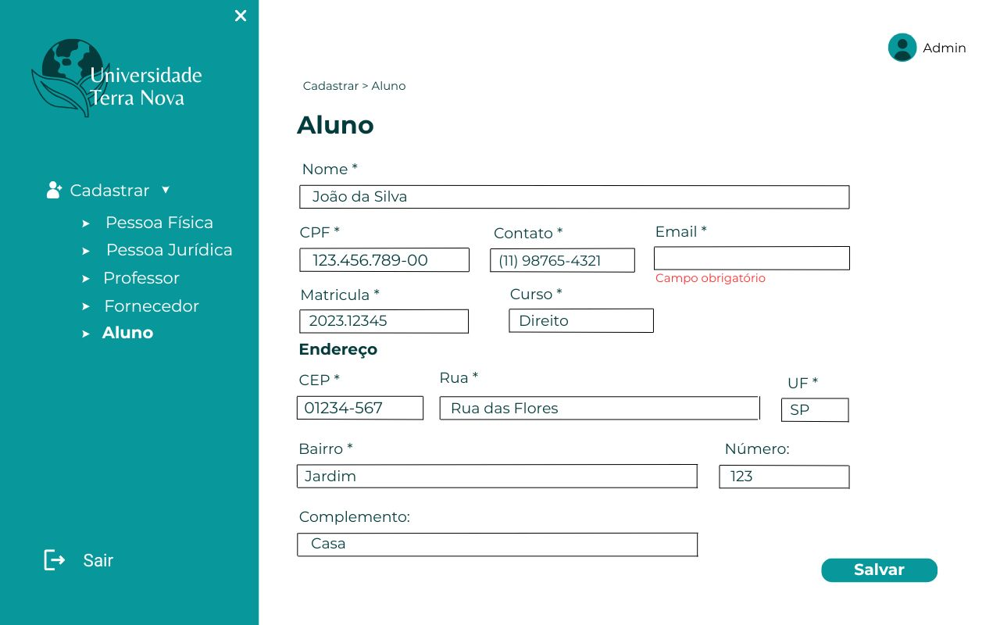
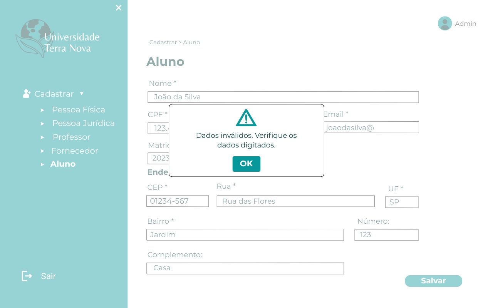

# PI2-POO
# SERVIÇO NACIONAL DE APRENDIZAGEM COMERCIAL  
**SENAC**  

## CURSO DE TECNOLOGIA EM ANÁLISE E DESENVOLVIMENTO DE SISTEMAS  

# PROJETO INTEGRADOR: DESENVOLVIMENTO DE SISTEMAS ORIENTADO A OBJETOS  

## RESUMO  
Esse projeto apresenta o desenvolvimento de um sistema orientado a objetos voltado para o gerenciamento de cadastros de pessoas e entidades em uma universidade. O projeto inclui a construção de diagramas de casos de uso e de classe para modelar os processos e suas interações, além da descrição dos cenários de interação entre o sistema e os usuários. O sistema implementado segue os princípios da programação orientada a objetos e utiliza boas práticas de desenvolvimento.  

## INTRODUÇÃO  
O objetivo deste projeto é desenvolver um sistema que facilite o gerenciamento de cadastros na universidade, permitindo o armazenamento e consulta eficiente de informações sobre alunos, professores, fornecedores e demais pessoas jurídicas associadas. A modelagem do sistema foi realizada utilizando UML (Unified Modeling Language), e a implementação segue os princípios da Programação Orientada a Objetos (POO).  

---

## DESENVOLVIMENTO  
### Modelagem do Sistema  
A modelagem foi feita utilizando diagramas UML para representar os principais elementos do sistema. Foram utilizados:  

- **Diagrama de Casos de Uso**: Representa as interações entre os usuários e o sistema.  
- **Diagrama de Classes**: Define a estrutura do sistema, incluindo as classes, atributos, métodos e relacionamentos.  

### Implementação  
O sistema foi desenvolvido utilizando a linguagem de programação **Java** e segue os princípios da Programação Orientada a Objetos, como encapsulamento, herança e polimorfismo. As principais classes do sistema incluem:  

- **Pessoa**: Classe base que contém os atributos e métodos comuns a todas as entidades.  
- **Aluno**: Subclasse de Pessoa, representa os estudantes cadastrados.  
- **Professor**: Subclasse de Pessoa, representa os professores cadastrados.  
- **Fornecedor**: Classe que representa as empresas fornecedoras de serviços e produtos para a universidade.  

### Banco de Dados  
O sistema utiliza um banco de dados relacional para armazenar as informações, garantindo a integridade e consistência dos dados. A persistência foi implementada utilizando **JDBC** para conexão com o banco de dados.  

---

## CONCLUSÃO  
O desenvolvimento deste sistema permitiu aplicar conceitos de análise e modelagem de sistemas orientados a objetos, além de boas práticas de programação e banco de dados. O sistema proporciona uma solução eficiente para o gerenciamento de cadastros na universidade, permitindo maior controle e organização das informações.  

##Diagramas
   Diagramas da primeira fase do projeto:
   
 
 

 ##Protótipo
  Protótipo Inicial: 

  
  
  
  
  
  
  
  
  
  
  
  
  
 
