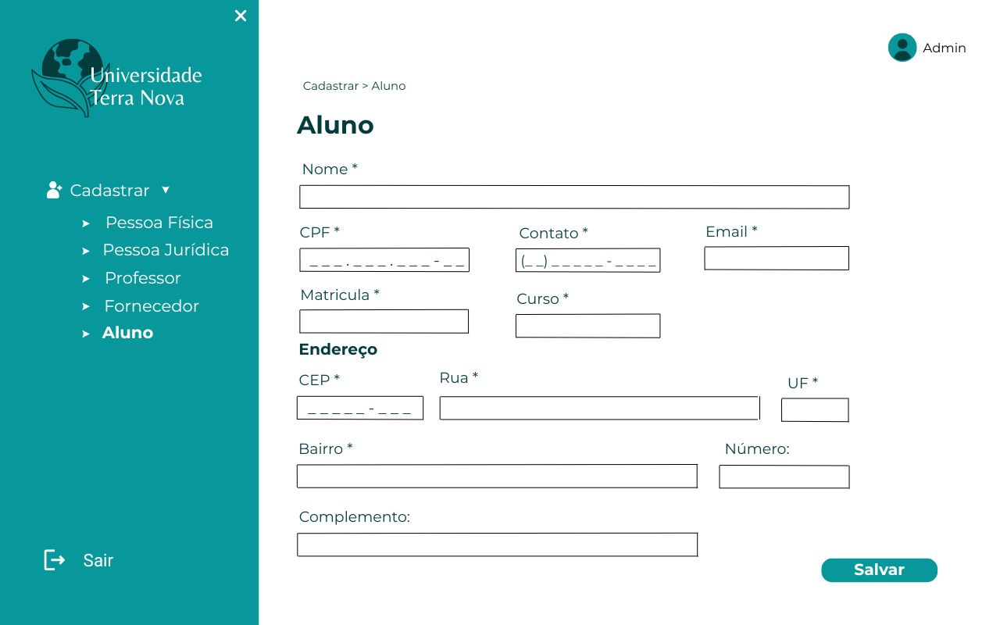
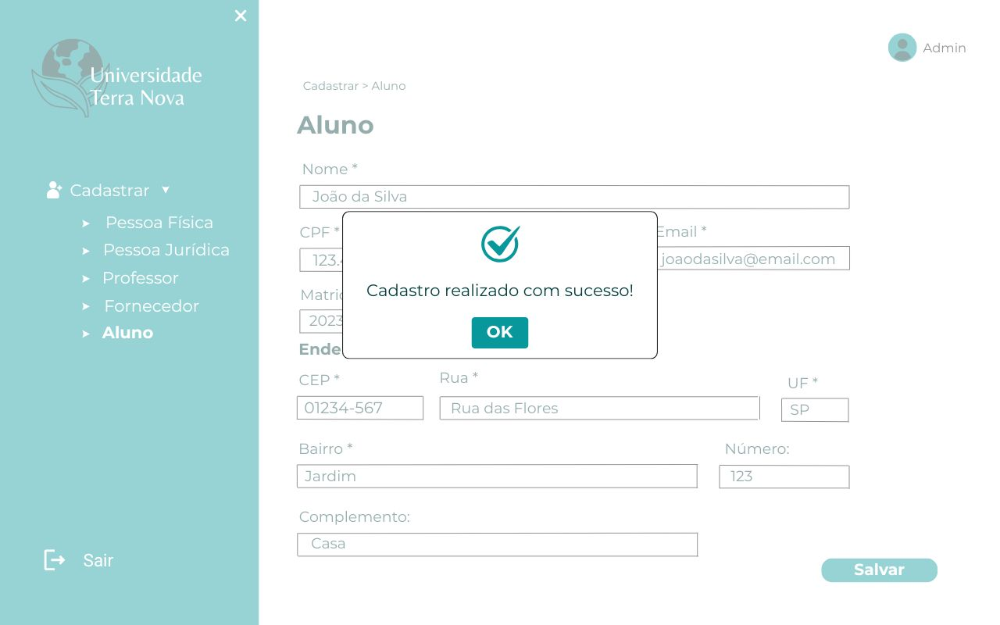

# PI2-POO
# SERVIÇO NACIONAL DE APRENDIZAGEM COMERCIAL  
**SENAC**  

## CURSO DE TECNOLOGIA EM ANÁLISE E DESENVOLVIMENTO DE SISTEMAS  

# PROJETO INTEGRADOR: DESENVOLVIMENTO DE SISTEMAS ORIENTADO A OBJETOS  

## RESUMO  
Esse projeto apresenta o desenvolvimento de um sistema orientado a objetos voltado para o gerenciamento de cadastros de pessoas e entidades em uma universidade. O projeto inclui a construção de diagramas de casos de uso e de classe para modelar os processos e suas interações, além da descrição dos cenários de interação entre o sistema e os usuários. O sistema implementado segue os princípios da programação orientada a objetos e utiliza boas práticas de desenvolvimento.  

## INTRODUÇÃO  
O objetivo deste projeto é desenvolver um sistema que facilite o gerenciamento de cadastros na universidade, permitindo o armazenamento e consulta eficiente de informações sobre alunos, professores, fornecedores e demais pessoas jurídicas associadas. A modelagem do sistema foi realizada utilizando UML (Unified Modeling Language), e a implementação segue os princípios da Programação Orientada a Objetos (POO).  

---

## DESENVOLVIMENTO  
### Modelagem do Sistema  
A modelagem foi feita utilizando diagramas UML para representar os principais elementos do sistema. Foram utilizados:  

- **Diagrama de Casos de Uso**: Representa as interações entre os usuários e o sistema.  
- **Diagrama de Classes**: Define a estrutura do sistema, incluindo as classes, atributos, métodos e relacionamentos.  

### IMPLEMENTAÇÃO 
O sistema foi desenvolvido utilizando a linguagem de programação **Java** e segue os princípios da Programação Orientada a Objetos, como encapsulamento, herança e polimorfismo. As principais classes do sistema incluem:  

- **Pessoa**: Classe base que contém os atributos e métodos comuns a todas as entidades.  
- **Aluno**: Subclasse de Pessoa, representa os estudantes cadastrados.  
- **Professor**: Subclasse de Pessoa, representa os professores cadastrados.  
- **Fornecedor**: Classe que representa as empresas fornecedoras de serviços e produtos para a universidade.  

### BANCO DE DADOS
O sistema utiliza um banco de dados relacional para armazenar as informações, garantindo a integridade e consistência dos dados. A persistência foi implementada utilizando **JDBC** para conexão com o banco de dados.  

---

## CONCLUSÃO  
O desenvolvimento deste sistema permitiu aplicar conceitos de análise e modelagem de sistemas orientados a objetos, além de boas práticas de programação e banco de dados. O sistema proporciona uma solução eficiente para o gerenciamento de cadastros na universidade, permitindo maior controle e organização das informações.  

## DIAGRAMAS

Diagrama de Casos de Uso:
 
 
 Diagrama de Classe:
 

 ## PROTÓTIPO I 
   
Tela Inicial:
  
 Cadastro Pessoa Física:
  
  Cadastro Pessoa Jurídica:
  
  Cadastro Professor:
  
  Cadastro Fornecedor:
  
  Cadastro Aluno:
  
  Cadastro Aluno Preenchido:
  
  Cadastro com Erro:
  
  Cadastro com Sucesso:
  

###  Visão do Produto

O sistema tem como objetivo centralizar e organizar o cadastro de entidades (pessoas físicas e jurídicas) em uma instituição de ensino, promovendo eficiência e segurança nos processos.

**Objetivos principais:**

- Reduzir erros operacionais (como duplicidade e dados incorretos);
- Garantir a integridade dos dados;
- Agilizar cadastros e atualizações;
- Facilitar o acesso aos dados pela administração.

**Problemas resolvidos:**

- Processos manuais sujeitos a erros;
- Dificuldade de manter um banco de dados organizado para diferentes perfis.

**Funcionalidades:**

- Cadastro de entidades físicas e jurídicas;
- Validação de CPF, CNPJ e campos obrigatórios;
- Interface simples e intuitiva.

---

###  Personas

#### Administradora — Ana Clara, 32 anos
- **Ocupação:** Assistente Administrativa  
- **Necessidades:** Agilidade e organização nos cadastros  
- **Desafios:** Cadastros inconsistentes e retrabalho  
- **Como o sistema ajuda:** Validação automática e interface intuitiva

#### Professor — José Almeida, 63 anos
- **Ocupação:** Professor de TI  
- **Necessidades:** Atualizar dados corretamente  
- **Desafios:** Processos de atualização lentos  
- **Como o sistema ajuda:** Garantia de dados válidos e processo facilitado

---

### Jornada das Personas

#### Ana Clara (Administradora)

| Etapa               | Ação                      | Ponto de Contato           | Dificuldades                  |
|---------------------|---------------------------|-----------------------------|-------------------------------|
| Login               | Acessa o sistema          | Tela de login               | Esquecimento de senha         |
| Escolher cadastro   | Seleciona o tipo          | Menu principal              | Seleção incorreta             |
| Preencher formulário| Insere dados              | Formulário de cadastro      | Dados incorretos              |
| Validação           | Sistema valida os dados   | Tela de feedback            | CPF/CNPJ inválido             |
| Salvar              | Clica em "Salvar"         | Botão de salvar             | -                             |
| Confirmação         | Visualiza mensagem final  | Tela de confirmação         | -                             |

#### José Almeida (Professor)

| Etapa               | Ação                         | Ponto de Contato           | Dificuldades                  |
|---------------------|------------------------------|-----------------------------|-------------------------------|
| Solicitar Cadastro  | Envia dados à administração  | Atendimento online/presencial| Dados incorretos             |
| Conferência         | Recebe confirmação           | E-mail e celular            | Não receber retorno           |
| Correções           | Solicita alterações          | Atendimento                 | Dados errados                |
| Atualização         | Dados atualizados no sistema | Sistema                     | -                             |
  
  
  
 
